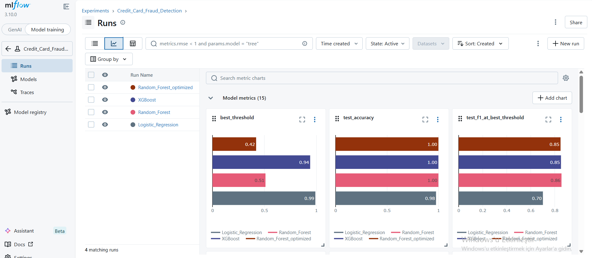

# Credit Card Fraud Detection

Kredi kartı dolandırıcılık tespiti projesi. PCA ile dönüştürülmüş 284,807 işlem üzerinde 3 farklı makine öğrenimi modeli eğitilmiş, karşılaştırılmış, SHAP ile açıklanmış ve FastAPI ile servis edilmiştir.

## Proje Yapısı

```
├── Data/
│   ├── creditcard.csv              # Ham veri (284,807 satır × 31 sütun)
│   └── processed/
│       ├── train_smote.parquet     # SMOTE ile dengelenmiş eğitim seti (398K satır)
│       ├── train_original.parquet  # Orijinal eğitim seti (dengelenmemiş)
│       ├── val.parquet             # Validation seti (%15)
│       └── test.parquet            # Test seti (%15)
├── eda.ipynb                       # Keşifsel Veri Analizi
├── preprocessing.ipynb             # Veri ön işleme (Feature Engineering, SMOTE, Scaling)
├── model_comparison.ipynb          # Model eğitimi ve karşılaştırma notebook'u
├── explainability.ipynb            # SHAP tabanlı model açıklanabilirliği
├── training.py                     # Eğitim/değerlendirme yardımcı fonksiyonlar
├── mlflow_tracking.py              # MLflow experiment tracking & model registry
├── api/
│   ├── __init__.py
│   ├── main.py                     # FastAPI uygulaması (POST /predict, GET /health)
│   └── schemas.py                  # Pydantic request/response şemaları
├── outputs/                        # Grafikler ve kaydedilmiş modeller
│   ├── models/                     # Joblib model dosyaları + scaler
│   └── *.csv                       # Model karşılaştırma tabloları
├── mlruns/                         # MLflow tracking verileri
├── requirements.txt                # Bağımlılıklar
└── README.md
```

## Modeller

| Model | Açıklama |
|-------|----------|
| Logistic Regression | Baseline model, saga solver |
| Random Forest | 200 trees, OOB score |
| XGBoost | 300 boosting rounds, logloss |
| Optimized (Optuna) | PR-AUC'si en yüksek modelin Bayesian optimizasyonu |

## Değerlendirme Metrikleri

- Confusion Matrix (validation + test ayrı ayrı)
- Classification Report (precision, recall, F1 — fraud sınıfı odaklı)
- Loss Curves (train/validation/test)
- ROC-AUC Curve
- Precision-Recall Curve (imbalanced data için daha bilgilendirici)
- Threshold Optimization (F1-maximizing threshold)

## Kurulum

```bash
pip install -r requirements.txt
```

## Kullanım

### 1. Model Eğitimi (terminal/script)
```bash
python training.py
```

### 2. Model Eğitimi (notebook)
`model_comparison.ipynb` dosyasını Jupyter/VS Code'da açıp hücreleri sırayla çalıştırın.

### 3. MLflow Tracking
```bash
python mlflow_tracking.py
```

### 4. MLflow UI
```bash
cd "proje_dizini"
mlflow ui
```
Tarayıcıdan [http://127.0.0.1:5000](http://127.0.0.1:5000) adresine gidin. Ya da kendi ayarladığınız bir local adrese.

### 5. Model Açıklanabilirliği (SHAP)
`explainability.ipynb` notebook'unu açıp hücreleri sırayla çalıştırın.

İçerikler:
- **Global feature importance** — Bar plot + beeswarm plot (ortalama |SHAP| değerleri)
- **Lokal açıklamalar** — 2 fraud + 2 normal işlem için waterfall plot
- **Yorumlayıcı özet** — "Bu işlem neden fraud olarak işaretlendi?" sorusuna 3 cümlelik yanıt

### 6. REST API (FastAPI)
```bash
uvicorn api.main:app --reload
```
Tarayıcıdan [http://127.0.0.1:8000/docs](http://127.0.0.1:8000/docs) adresine giderek Swagger UI üzerinden endpoint'leri test edebilirsiniz.

#### Endpoint'ler

| Metot | Yol | Açıklama |
|-------|-----|----------|
| `GET` | `/health` | Sağlık kontrolü — `{"status": "ok", "model_version": "1.0"}` |
| `POST` | `/predict` | Fraud tahmini — V1-V28, Amount, Time gönderilir |
| `GET` | `/docs` | Swagger UI (otomatik) |

#### Örnek İstek
```json
POST /predict
{
  "features": {
    "V1": -1.36, "V2": -0.07, "V3": 2.54, "V4": 1.38,
    "V5": -0.34, "V6": 0.46, "V7": 0.24, "V8": 0.10,
    "V9": 0.36, "V10": 0.09, "V11": -0.55, "V12": -0.62,
    "V13": -0.99, "V14": -0.31, "V15": 1.47, "V16": -0.47,
    "V17": 0.21, "V18": 0.03, "V19": 0.40, "V20": 0.25,
    "V21": -0.02, "V22": 0.28, "V23": -0.11, "V24": -0.34,
    "V25": -0.07, "V26": -0.06, "V27": -0.03, "V28": -0.01,
    "Amount": 149.62, "Time": 0.0
  }
}
```

#### Örnek Yanıt
```json
{
  "is_fraud": false,
  "fraud_probability": 0.0312,
  "risk_level": "LOW"
}
```

**Özellikler:**
- Model, MLflow registry'den yüklenir (joblib fallback)
- 5 mühendislik feature'ı API tarafında otomatik hesaplanır
- Pydantic ile input validation
- In-memory rate limiting (100 istek/dakika/IP)

## MLflow UI Ekran Görüntüsü

> `mlflow ui` komutunu çalıştırdıktan sonra ekran görüntüsünü buraya ekleyin.



## Veri Seti

- **Kaynak**: [Kaggle — Credit Card Fraud Detection](https://www.kaggle.com/mlg-ulb/creditcardfraud)
- **Toplam**: 284,807 işlem, %0.172 fraud
- **Features**: V1-V28 (PCA), Time, Amount + 5 mühendislik özelliği
- **Train/Val/Test**: %70/%15/%15 stratified split
- **Dengeleme**: SMOTE (sadece train setine)
